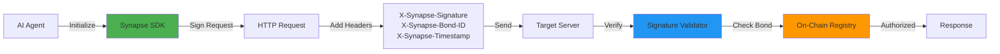

```
 ███████╗██╗   ██╗███╗   ██╗ █████╗ ██████╗ ███████╗███████╗
 ██╔════╝╚██╗ ██╔╝████╗  ██║██╔══██╗██╔══██╗██╔════╝██╔════╝
 ███████╗ ╚████╔╝ ██╔██╗ ██║███████║██████╔╝███████╗█████╗  
 ╚════██║  ╚██╔╝  ██║╚██╗██║██╔══██║██╔═══╝ ╚════██║██╔══╝  
 ███████║   ██║   ██║ ╚████║██║  ██║██║     ███████║███████╗
 ╚══════╝   ╚═╝   ╚═╝  ╚═══╝╚═╝  ╚═╝╚═╝     ╚══════╝╚══════╝
```

<div align="center">

# Web Bot Auth SDK

**Enterprise-grade TypeScript implementation of the Web Bot Auth standard**

[](https://www.npmjs.com/package/synapse-agent-kit)
[](https://opensource.org/licenses/MIT)
[](https://github.com/Synapse-Founder/synapse-agent-kit)
[](https://www.typescriptlang.org/)
[](https://synapse-arch.com)

[Documentation](https://synapse-arch.com) • [NPM Package](https://www.npmjs.com/package/synapse-agent-kit) • [Examples](#examples) • [Contributing](#contributing)

</div>

---

## Overview

**Synapse Agent Kit** is a lightweight, zero-dependency TypeScript SDK that implements the **Web Bot Auth** standard. It provides cryptographic authentication for AI agents, preventing anti-bot blocking through HMAC-SHA256 signatures and economic accountability via on-chain surety bonds.

### Why Web Bot Auth?

Modern web infrastructure increasingly blocks automated traffic—even from legitimate AI agents. Traditional solutions (IP rotation, browser fingerprinting) are fragile and expensive. Web Bot Auth solves this by:

- **Cryptographic Identity**: Each request carries a verifiable signature
- **Economic Accountability**: Agents stake collateral to prove trustworthiness
- **Standard Protocol**: Works across any compliant service provider
- **Zero Friction**: Drop-in replacement for `fetch()` with 3 lines of code

---

## Architecture



**Flow:**
1. Agent initializes SDK with API key and Bond ID
2. SDK signs each HTTP request with HMAC-SHA256
3. Server validates signature and checks bond status
4. Authorized requests proceed; invalid ones are rejected

---

## Installation

```bash
npm install synapse-agent-kit
```

**Requirements:**
- Node.js ≥ 18.0.0
- TypeScript ≥ 5.0.0 (optional)

---

## Quick Start

### Basic Usage

```typescript
import { Synapse } from 'synapse-agent-kit';

// Initialize with your credentials
const synapse = new Synapse({
  apiKey: 'sk_live_your_api_key',
  bondId: '0x742d35Cc6634C0532925a3b844Bc9e7595f0bEb',
  agentId: 'my-agent-v1'
});

// Use exactly like fetch()
const response = await synapse.fetch('https://api.example.com/data');
const data = await response.json();
```

### Test Mode (Sandbox)

Test your integration without spending real tokens:

```typescript
const synapse = new Synapse({
  apiKey: 'sk_test_key',
  bondId: '0x000000000000000000000000000000000000dead', // Universal test ID
  debug: true
});

// All requests bypass cryptographic verification
await synapse.fetch('https://api.example.com/test');
```

> **Note:** When using the test bond ID, you'll see: `🟨 SYNAPSE: Running in SANDBOX MODE (No real value bonded)`

---

## Examples

### Price Monitoring Agent

```typescript
const synapse = new Synapse({
  apiKey: 'sk_live_demo_abc123xyz789',
  bondId: '0x742d35Cc6634C0532925a3b844Bc9e7595f0bEb',
  agentId: 'price-monitor-v1'
});

const stores = [
  'https://api.store-alpha.com/products/12345',
  'https://api.store-beta.com/v1/items/gaming-laptop',
  'https://api.store-gamma.com/pricing/electronics/67890'
];

for (const url of stores) {
  const response = await synapse.fetch(url);
  const data = await response.json();
  console.log(`Price: $${data.price}`);
}
```

### POST Requests with Authentication

```typescript
const response = await synapse.fetch('https://api.example.com/alerts', {
  method: 'POST',
  headers: {
    'Content-Type': 'application/json'
  },
  body: JSON.stringify({
    productId: '12345',
    targetPrice: 799.99,
    notifyEmail: 'agent@example.com'
  })
});
```

### Server-Side Signature Verification

```typescript
import { Synapse } from 'synapse-agent-kit';

// Extract headers from incoming request
const signature = req.headers['x-synapse-signature'];
const bondId = req.headers['x-synapse-bond-id'];
const timestamp = req.headers['x-synapse-timestamp'];

// Verify the signature
const isValid = Synapse.verifySignature(
  signature,
  apiKey,
  req.method,
  req.url,
  timestamp,
  bondId,
  req.body
);

if (!isValid) {
  return res.status(401).json({ error: 'Invalid signature' });
}
```

**More examples:** See [`examples/`](./examples) directory for complete working samples.

---

## API Reference

### Constructor

```typescript
new Synapse(config: SynapseConfig)
```

**Parameters:**

| Parameter | Type | Required | Description |
|-----------|------|----------|-------------|
| `apiKey` | `string` | ✅ | Your API key for signing requests |
| `bondId` | `string` | ✅ | Your on-chain bond identifier (use `0x000000000000000000000000000000000000dead` for testing) |
| `agentId` | `string` | ❌ | Custom agent identifier (auto-generated if not provided) |
| `debug` | `boolean` | ❌ | Enable debug logging (default: `false`) |

### Methods

#### `synapse.fetch(url, options?)`

Drop-in replacement for the standard `fetch()` API with automatic authentication.

**Returns:** `Promise<Response>`

#### `synapse.signRequest(method, url, body?)`

Manually generate authentication headers for custom HTTP clients.

**Returns:** `SynapseHeaders`

#### `Synapse.verifySignature(signature, apiKey, method, url, timestamp, bondId, body?)`

Static method for server-side signature verification.

**Returns:** `boolean`

---

## Authentication Headers

Synapse automatically adds the following headers to your requests:

| Header | Description |
|--------|-------------|
| `X-Synapse-Bond-Id` | On-chain surety bond identifier |
| `X-Synapse-Signature` | HMAC-SHA256 signature of the request |
| `X-Synapse-Agent-Id` | Unique agent identifier |
| `X-Synapse-Timestamp` | Request timestamp (replay protection) |
| `X-Synapse-Version` | Protocol version |

---

## Security

- **HMAC-SHA256 Signing**: Cryptographic request signatures
- **Replay Attack Prevention**: Timestamp-based request validation
- **Timing-Safe Comparison**: Prevents timing attacks on signature verification
- **Economic Accountability**: Bond IDs provide real economic stake (production mode)

---

## Provider Compatibility

This SDK implements the Web Bot Auth standard and works with any compatible bond provider:

- **SYNAPSE**: Reference implementation with Polygon mainnet bonds
- **Custom Providers**: Any service implementing the standard's signature protocol

To use a different provider, simply provide their bond ID and API key during initialization.

---

## Contributing

We welcome contributions! Please see our [Contributing Guide](./CONTRIBUTING.md) for details.

**Quick Start:**
1. Fork the repository
2. Create your feature branch (`git checkout -b feature/amazing-feature`)
3. Commit your changes (`git commit -m 'Add some amazing feature'`)
4. Push to the branch (`git push origin feature/amazing-feature`)
5. Open a Pull Request

---

## License

MIT License - see [LICENSE](LICENSE) file for details.

---

## Links

- **Official Dashboard**: [synapse-arch.com](https://synapse-arch.com)
- **GitHub Repository**: [github.com/Synapse-Founder/synapse-agent-kit](https://github.com/Synapse-Founder/synapse-agent-kit)
- **NPM Package**: [npmjs.com/package/synapse-agent-kit](https://www.npmjs.com/package/synapse-agent-kit)
- **Report Issues**: [github.com/Synapse-Founder/synapse-agent-kit/issues](https://github.com/Synapse-Founder/synapse-agent-kit/issues)

---

## Support

For questions and support, please:
- Open an issue on [GitHub](https://github.com/Synapse-Founder/synapse-agent-kit/issues)
- Visit our [official documentation](https://synapse-arch.com)

---

<div align="center">

**Built for the AI agent ecosystem**

Made with ❤️ by the SYNAPSE team

</div>
